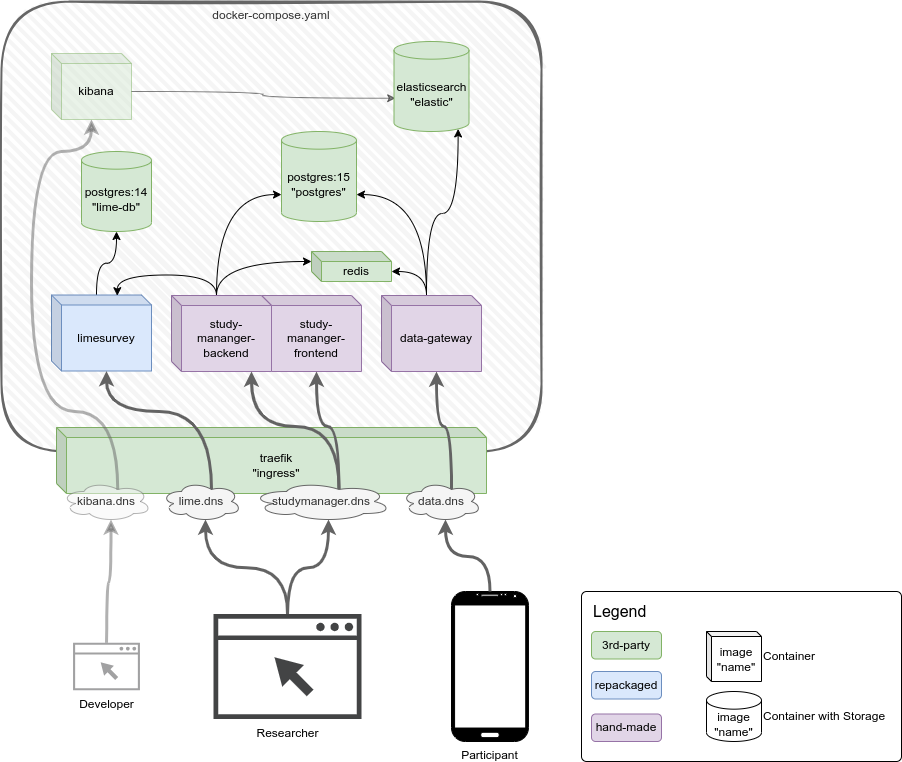

# MORE Deployment: Docker

_Running the MORE Platform on Docker_

---

## Intro

The deployment-configuration is based on [docker compose](https://docs.docker.com/compose/).
This repository conatains a set of compose-files that can be used to launch different environments
of the MORE Platform using docker compose.



The repository contains several docker-compose.yaml files to allow a flexible configuration of the platform deployment.
The basic deployment can be launched with the following command:

```shell
export DC_ENV=test
./docker-compose.sh up -d
```

<details>
<summary>About the docker-compose.sh script</summary>

The shell-script `docker-compose.sh` will combine different compose-files together:
* `docker-compose.yaml` - the basic defaults
* `docker-compose.deploy.yaml` - deployment overrides

    Adds additional services like `watchtower` and `autohealer` and configures the `ingress` for production

* `docker-compose.${DC_ENV}.yaml` - environment-specific overrides (optional)

    Allows adding environment-specific overrides

* `docker-compose.local.yaml` - local overrides (on the server, not managed by git)

    This allows to add additional overrides directly on the server.

</details>

This command launches all required components and configures the ingress proxy to enable ssl-termination with
a [letsencrypt](https://letsencrypt.org/) certificate.

> :warning: **Make sure to correctly set the email-address for the letsencrypt account and configure matching DNS-Names
> for the traefik-labels!**<br>
> Those settings can be found in the `docker-compose.deploy.yaml` and should be configured in an env-specific or local
> override file - look for `traefik.http.routers.*.rule`.

The deployment also contains a [watchtower](https://github.com/containrrr/watchtower)-sidecar that keeps all container
images at their latest version. It continuously checks the container-registries for new version and automatically
updates the deployment whenever a new version is found.

Further, there's an [autoheal](https://github.com/willfarrell/docker-autoheal) service that continuously monitors the
health-checks of all services and restarts any container that switches into the `unhealthy` state.

## Environments

The minimal configuration for a new environment would contain the following settings:

```yaml
services:
  ingress:
    environment:
      # let's-encrypt config
      TRAEFIK_CERTIFICATESRESOLVERS_LE_ACME_EMAIL: "more-platform@example.com"

  study-manager-backend:
    labels:
      'traefik.http.routers.studymanager-backend.rule': "Host(`studymanager.example.com`) && (PathPrefix(`/api`) || PathPrefix(`/kibana`) || PathPrefix(`/oauth2`) || PathPrefix(`/login`))"
    environment:
      OAUTH2_SERVER: https://auth.example.com/realms/More-Platform
      OAUTH2_CLIENT_ID: study-manager
      OAUTH2_CLIENT_SECRET: ''
    
      MORE_FE_TITLE: "Example MORE Studymanager"
      MORE_FE_KC_SERVER: https://auth.example.com/
      MORE_FE_KC_REALM: More-Platform
      MORE_FE_KC_CLIENT_ID: study-manager

      LIME_URL: https://lime.example.com/admin/remotecontrol
      LIME_SURVEY_URL: https://lime.example.com/index.php
      LIME_END_SURVEY_URL: https://studymanager.example.com/api/v1/components/observation/lime-survey-observation/end.html

  study-manager-frontend:
    labels:
      'traefik.http.routers.studymanager-frontend.rule': "Host(`studymanager.example.com`)"

  data-gateway:
    labels:
      'traefik.http.routers.dsb-gateway.rule': "Host(`data.example.com`)"

  limesurvey:
    labels:
      'traefik.http.routers.limesurvey.rule': "Host(`lime.example.com`)"
```

## Setup

Besides deploying the MORE Platform, some components and services require additional setup and configuration:

### Auth Server

The Auth-Server is hosted externally and not as part of this deployment.
See the [Keycloak Setup Guide](https://github.com/MORE-Platform/more-auth-keycloak#setup)
for further details and the required initial configuration.

### Limesurvey Setup

Details of the required setup-procedure for limesurvey is covered in a
[separate documentation](SETUP_LIMESURVEY.md).